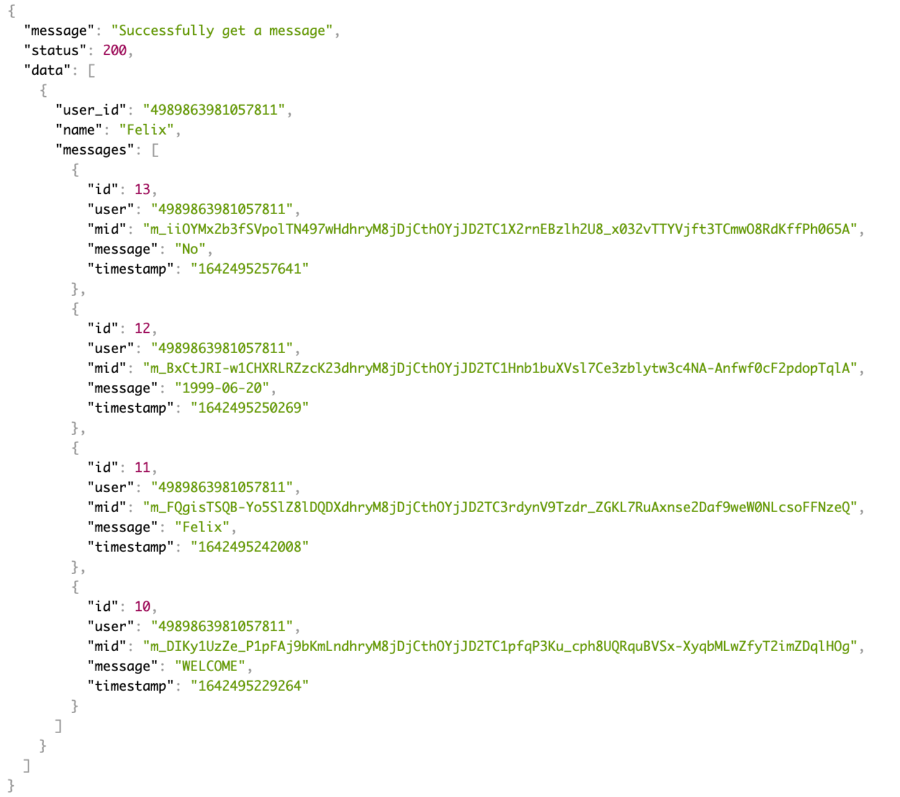

# Facebook Messenger Bot (NodeJS)

## Built with : 
- [ExpressJS](https://expressjs.com/)
- [NodeJS](https://nodejs.org/en/)
- [Sequelize ORM](https://sequelize.org/)

---

## Getting Started
### Prerequisites
- npm  
  ```
  npm install npm@latest -g
  ```
- yarn  
  ```
  npm install -g yarn
  ```


### Installation
1. Clone repository  
   ```
   git clone https://github.com/felixyunianto/facebook-messenger-bot-nodejs.git
   ```
  
2. Install dependencies  
   With Yarn 
   ```
   yarn
   ```
   With NPM
   ```
   npm install
   ```

3. Create facebook page  
   
4. Setting facebook app
   

    Next, head to **Messenger Widget** then find access token and add new page to create PAGE_ACCESS_TOKEN
    

    Setting Webhook
    

5. Create database (exmaple : facebook-bot)
6. Copy the .env.example file to .env and fill it in.  
   | Name                   | Desc                                                          | 
   | -----                  | ----                                                          |
   | DB_USERNAME            | Database Username                                             |    
   | DB_PASSWORD            | Database Password                                             |
   | DB_HOST                | Database Host                                                 |
   | DB_DATABASE            | Database Name                                                 |
   | PAGE_ACCESS_TOKEN      | Page Acces Token Facebook                                     |
   | VERIFY_TOKEN           | the token that is in the settings in the facebook application |

7. Migrate all tables to database
   ```
      npx sequelize db:migrate
   ```

8. Run the project   
   ```
    yarn server or npm run dev
   ```


## RESULT

### Messenger

|                          |                          |
:-------------------------:|:-------------------------:
| | |
| | |
| | |

### REST API
| ENDPOINT                 | DESC|
|-------------------------|-------------------------|
|`/messages` | that list all messages received from users|
|`/messages/:id` | view single message by its ID |
|`/summary` | view this data exact data|

#### All messages


#### Message by ID


#### Summary


### TEST
